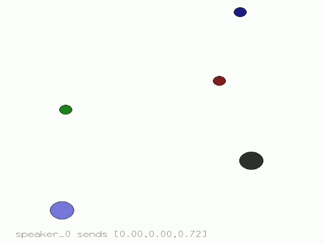
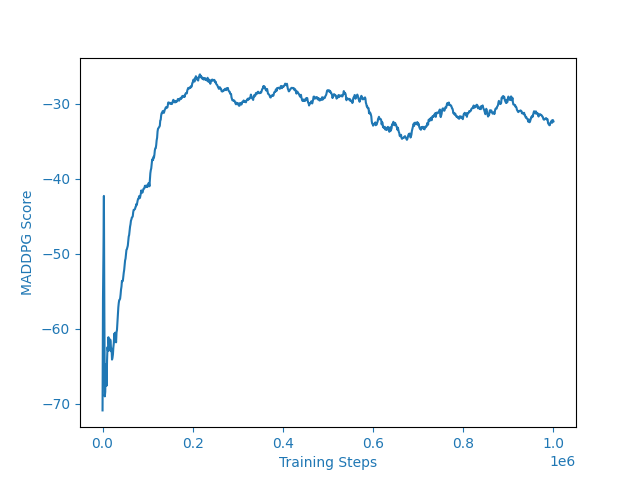

# MARL
Multi agent reinforcement learning: PyTorch implementations of several algorithms for Multi Agent domains

## 1. MADDPG (Multi Agent Deep Deterministic Policy Gradient):
- MADDPG extends the DDPG algorithm to multi-agent settings by using centralized learning and decentralized execution. Each agent has a centralized critic that evaluates all agents' actions, while having a decentralized actor for decision-making.
- Paper: [Multi-Agent Actor-Critic for Mixed Cooperative-Competitive Environments](https://arxiv.org/abs/1706.02275)
  
### Simple-speaker-listener-v4
Demo| Results| 
:-----------------------:|:-----------------------:|
| | 

### :bell: More algorithms and enhancements are coming soon!

## Installation
```bash
git clone git@github.com:mobinajamali/MARL.git
```
```shell
pip install -r requirements.txt
```


## Acknowledgement
Shout out to [Phil Tabor](https://www.youtube.com/machinelearningwithphil) for his brilliant courses!  

